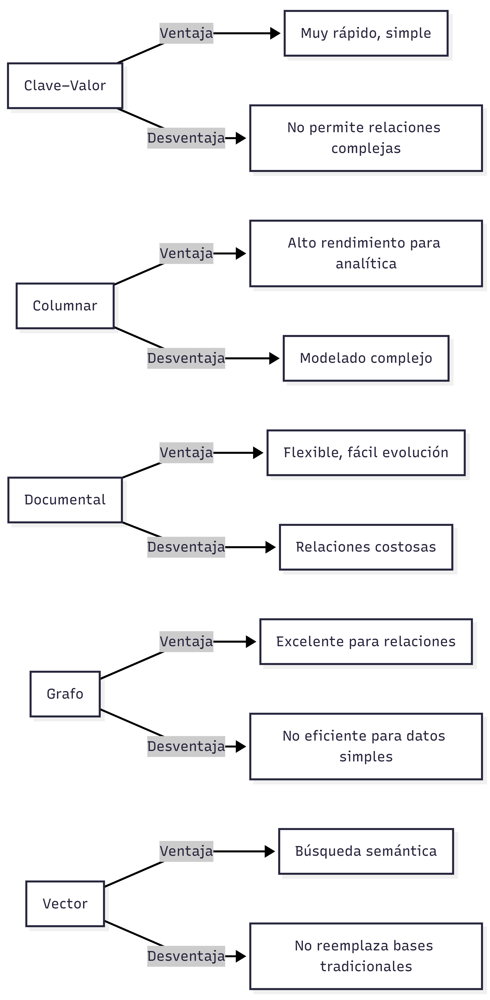

# Clase 3 – Casos de uso y elección de NoSQL

### Objetivo de la clase

Aprender a seleccionar el tipo de base de datos NoSQL según las necesidades del sistema y los requerimientos de los datos.

### Factores a considerar

1. **Tipo de datos**
   
   - Estructurados → SQL puede ser suficiente
   - Semiestructurados → Documental o Columnar
   - Relaciones complejas → Grafo
   - Datos vectoriales → IA / búsqueda semántica
2. **Volumen y velocidad**
   
   - Escala masiva de lecturas → Columnar o Clave–Valor
   - Escrituras rápidas y concurrentes → Clave–Valor o Documental
3. **Relaciones entre datos**
   
   - Relaciones profundas → Grafo
   - Relaciones simples → Documental o SQL
4. **Disponibilidad vs consistencia**
   
   - Alta disponibilidad → Clave–Valor o Documental (BASE)
   - Consistencia fuerte → SQL o Documental transaccional
5. **Evolución del modelo**
   
   - Cambios frecuentes → Documental
   - Modelo estable → Columnar o SQL

