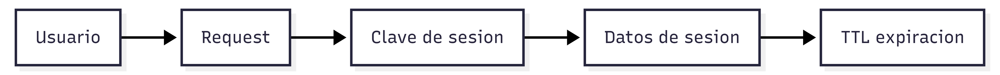

# Bases de datos Clave–Valor

### **Enunciado de ejemplo**

Se necesita almacenar y recuperar sesiones de usuario para una aplicación web con millones de accesos diarios.

Cada sesión debe recuperarse en menos de 5 ms, no requiere relaciones con otros datos y puede expirar automáticamente tras un periodo de inactividad.

### **Análisis semántico**

El enunciado menciona explícitamente:

* Accesos muy frecuentes
* Latencia extremadamente baja
* Datos simples asociados a una clave
* No hay relaciones entre entidades
* Los datos tienen caducidad

Semánticamente, el problema no habla de: consultas complejas, ni de filtrados, ni de agregaciones.

La palabra clave aquí es ​**acceso directo y rápido a un valor conocido**​.

## **Decisión**

Una base de datos Clave–Valor es la opción natural porque:

* Permite acceso O(1) por clave
* Es extremadamente rápida
* Soporta TTL (time to live)
* Escala horizontalmente sin complejidad

Ejemplos: Redis, DynamoDB (modo KV).

