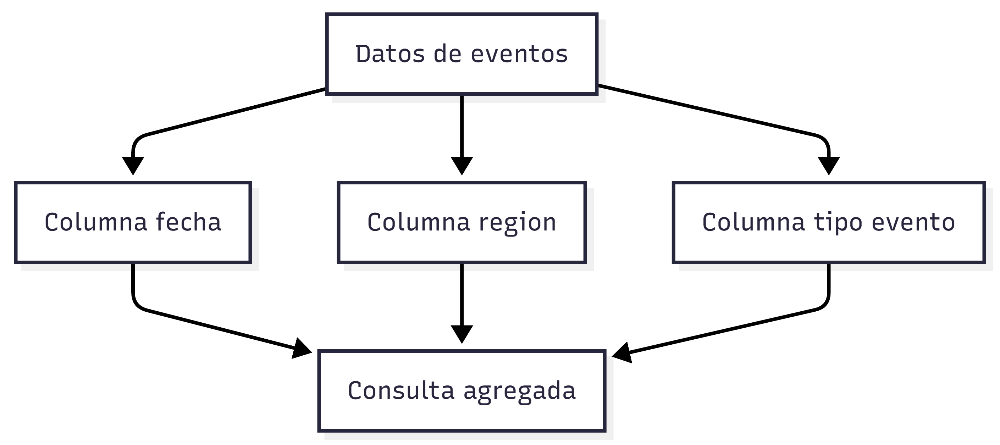

# Bases de datos Columnar

### **Enunciado de ejemplo**

Una empresa recopila miles de millones de eventos diarios provenientes de sensores y aplicaciones.

Se necesita realizar consultas analíticas agregadas por fecha, región y tipo de evento, priorizando velocidad de lectura sobre actualizaciones individuales.

### **Análisis semántico**

El lenguaje del enunciado apunta a:

* Volumen masivo de datos
* Datos homogéneos y repetitivos
* Consultas por rangos y agregaciones
* Predominio de lecturas analíticas
* Escrituras por lotes, no transaccionales

Semánticamente, no se habla de registros individuales, sino de ​**patrones globales en grandes conjuntos de datos**​.

### **Decisión**

Una base de datos columnar es adecuada porque:

* Optimiza lecturas por columnas específicas
* Reduce I/O en consultas analíticas
* Escala horizontalmente grandes volúmenes
* Está diseñada para Big Data

## ¿Qué significa “agregaciones”?

**Agregar** significa **resumir grandes volúmenes de datos** aplicando funciones matemáticas o estadísticas sobre una o varias columnas, sin trabajar registro por registro de forma individual.

### Qué es una agregación

Una agregación toma muchos valores y produce ​**un resultado compacto**​.

Ejemplos típicos:

* Conteo
* Suma
* Promedio
* Máximo / mínimo
* Agrupaciones por categorías

Conceptualmente:

En lugar de:
“Muéstrame cada evento”

Se pregunta:
“Resume los eventos”

Ejemplos: Cassandra, HBase, Bigtable.

