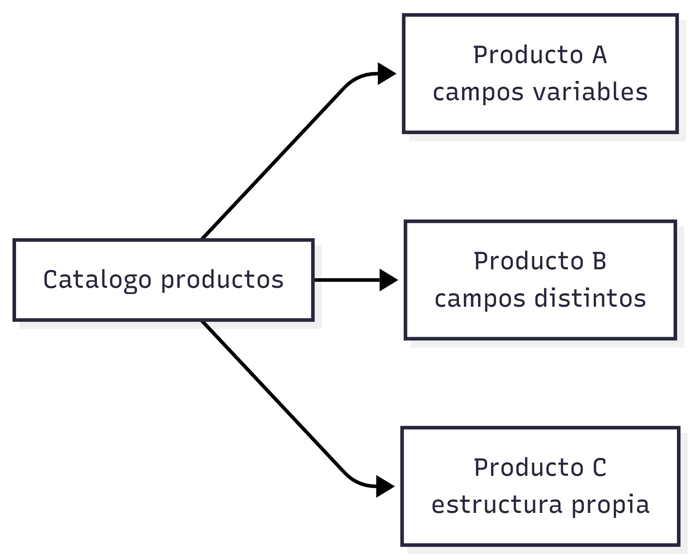

# Bases de datos Documentales

### **Enunciado de ejemplo**

Se debe construir un sistema de catálogo para un e-commerce donde cada producto puede tener atributos distintos según su categoría.

El modelo de datos puede cambiar con frecuencia y se requiere consultar productos por múltiples campos.

### **Análisis semántico**

El enunciado destaca:

* Entidades con estructura variable
* Cambios frecuentes en el modelo
* Consultas flexibles por distintos atributos
* Datos naturalmente agrupados por entidad

Aquí el significado clave es **flexibilidad estructural** y ​**autonomía de cada entidad**​.

### **Decisión**

Una base de datos documental es ideal porque:

* Permite esquemas dinámicos
* Modela cada entidad como un documento autocontenido
* Facilita evolución sin migraciones costosas
* Soporta índices y consultas ricas

Ejemplos: MongoDB, CouchDB.

