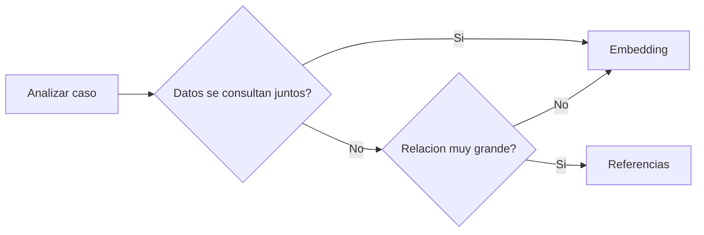

# Conclusión

El modelado en MongoDB no elimina el diseño, lo transforma.

La decisión correcta depende del patrón de acceso.

```mermaid
flowchart LR
    Inicio[Analizar caso]
    Inicio --> ConsultaFrecuente
    ConsultaFrecuente{Datos se consultan juntos?}

    ConsultaFrecuente -->|Si| Embedding
    ConsultaFrecuente -->|No| EvaluarTamano

    EvaluarTamano{Relacion muy grande?}
    EvaluarTamano -->|Si| Referencias
    EvaluarTamano -->|No| Embedding
```

