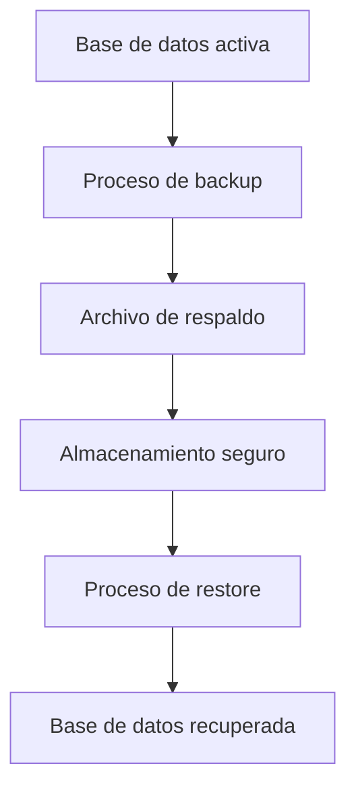

# Concepto de respaldo en bases de datos

Un respaldo o backup consiste en una copia controlada del estado de la base de datos en un momento determinado. Esta copia permite reconstruir el sistema si ocurre una pérdida de información.

Desde una perspectiva conceptual, el ciclo de protección de datos puede representarse así:

El objetivo de un respaldo no es simplemente duplicar archivos, sino garantizar que:

* los datos puedan recuperarse
* la estructura de las colecciones se preserve
* los índices puedan reconstruirse
* el sistema vuelva a un estado consistente

MongoDB proporciona dos herramientas principales para este propósito:

* mongodump
* mongorestore

Estas herramientas forman parte del conjunto de utilidades administrativas de MongoDB.

