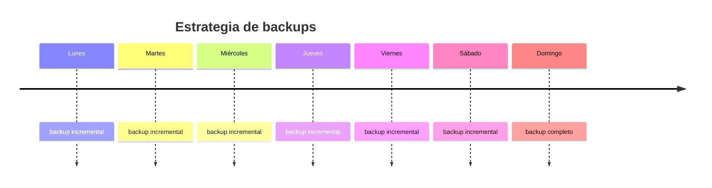

# Estrategias de respaldo en entornos reales

En sistemas empresariales, los respaldos se planifican como procesos automatizados. La política de respaldo suele definir:

* frecuencia de copias
* retención histórica
* ubicación de almacenamiento

Ejemplo de estrategia típica:

| Tipo de backup | Frecuencia       |
| ---------------- | ------------------ |
| Completo       | semanal          |
| Incremental    | diario           |
| Snapshot       | cada pocas horas |

Un diagrama simplificado de esta estrategia sería:

Buenas prácticas recomendadas incluyen:

* almacenar backups en servidores diferentes
* probar regularmente los procesos de restauración
* mantener copias offline o en almacenamiento frío
* automatizar tareas mediante cron o pipelines

Un backup que nunca se ha probado no garantiza recuperación.

