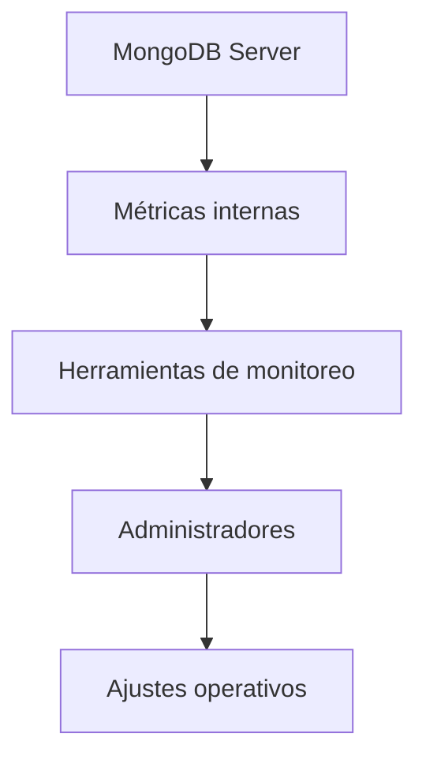

# Observabilidad básica en MongoDB

Además de respaldos, es importante poder observar el comportamiento del sistema. La **observabilidad** permite detectar problemas antes de que se conviertan en fallos críticos.

MongoDB ofrece varias herramientas para este propósito:

* `db.stats()`
* `db.serverStatus()`
* `db.currentOp()`
* `db.collection.stats()`

Ejemplo simple:

```JS
db.stats()
```

Este comando devuelve información como:

```JSON
{
  "db": "universidad",
  "collections": 4,
  "objects": 2500,
  "avgObjSize": 850,
  "dataSize": 2125000,
  "storageSize": 4194304
}
```

Esta información permite estimar:

* crecimiento de datos
* uso de almacenamiento
* número de documentos

Otro comando importante es:

```JS
db.serverStatus()
```

Este comando proporciona métricas internas del servidor:

* número de conexiones activas
* operaciones por segundo
* uso de memoria
* actividad del motor de almacenamiento

Conceptualmente, la observabilidad se organiza así:



En entornos empresariales estas métricas suelen integrarse con herramientas externas de monitoreo como Prometheus o Grafana.

