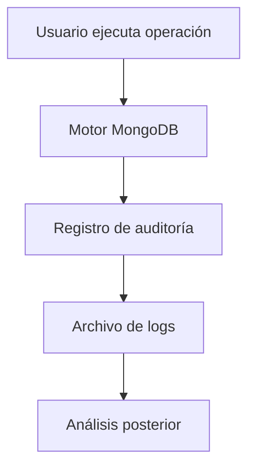

# Auditoría de operaciones

La auditoría permite registrar qué usuarios realizan operaciones dentro del sistema. Este registro es especialmente importante en entornos regulados, donde se requiere trazabilidad de acceso a los datos.

MongoDB puede registrar eventos como:

* autenticación de usuarios
* creación o eliminación de colecciones
* modificaciones de documentos
* cambios en permisos

Conceptualmente, el flujo de auditoría es el siguiente:

Estos registros permiten responder preguntas críticas:

* ¿quién eliminó una colección?
* ¿qué usuario modificó determinados datos?
* ¿cuándo ocurrió un incidente?

En sistemas complejos, los logs de auditoría suelen integrarse con plataformas de análisis de seguridad.

