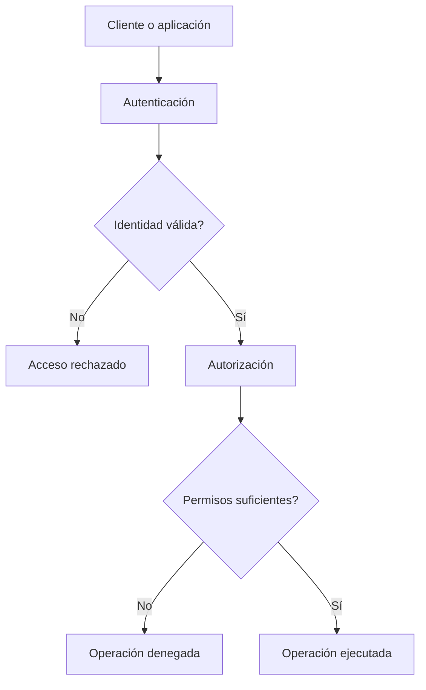

# Modelo de autenticación y autorización en MongoDB

MongoDB separa claramente dos conceptos fundamentales de seguridad: autenticación y autorización.

La autenticación se encarga de verificar la identidad del usuario que intenta conectarse al sistema.

 La ​autorización​, en cambio, determina qué operaciones puede realizar ese usuario una vez que ha sido autenticado.

Este modelo puede representarse de forma conceptual de la siguiente manera:

MongoDB utiliza por defecto el mecanismo de autenticación ​SCRAM (Salted Challenge Response Authentication Mechanism)​, que protege las credenciales mediante técnicas criptográficas y evita el envío de contraseñas en texto plano.

Cuando la autenticación está habilitada:

* No se permiten operaciones anónimas
* Toda conexión debe identificarse con un usuario
* Cada operación se ejecuta bajo el contexto de permisos de ese usuario

Esto convierte a la base de datos en un sistema con control de acceso explícito.

