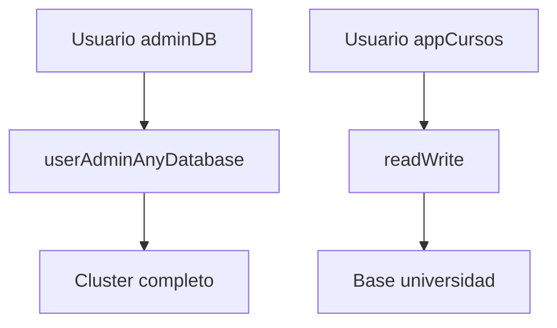

# Creación de usuarios en MongoDB

La gestión de usuarios en MongoDB se realiza normalmente desde la base de datos `admin` o desde la base específica donde el usuario tendrá permisos.

Un usuario se define mediante tres componentes principales:

* nombre de usuario
* contraseña
* roles asignados

Ejemplo básico de creación de usuario en ​**mongosh**​:

```JS
use admin

db.createUser({
  user: "adminDB",
  pwd: "passwordSeguro123",
  roles: [
    { role: "userAdminAnyDatabase", db: "admin" }
  ]
})
```

Este usuario podrá administrar usuarios en todas las bases de datos.

Ejemplo de usuario para una aplicación:

```JS
use universidad

db.createUser({
  user: "appCursos",
  pwd: "claveAplicacion",
  roles: [
    { role: "readWrite", db: "universidad" }
  ]
})
```

Este usuario solo podrá leer y escribir en la base `universidad`.

Podemos visualizar el modelo de permisos de la siguiente manera:



