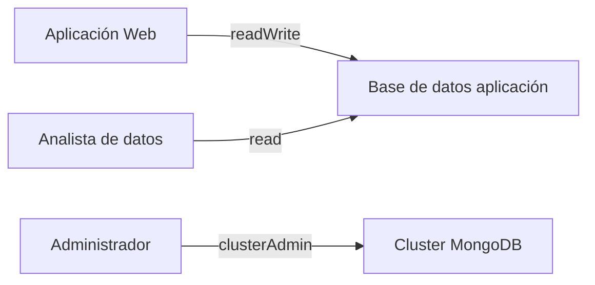

# Principio de mínimo privilegio

Uno de los conceptos más importantes en seguridad informática es el ​**principio de mínimo privilegio**​. Este principio establece que un usuario o sistema debe tener únicamente los permisos estrictamente necesarios para realizar su función.

Aplicado a MongoDB, esto implica:

* Las aplicaciones solo deben tener permisos sobre sus propias colecciones
* Los analistas de datos deben tener permisos de lectura
* Los administradores del sistema deben tener permisos completos

Ejemplo de segmentación típica:

Ventajas de aplicar este principio:

* Reduce el impacto de errores humanos
* Limita daños en caso de compromisos de seguridad
* Mejora la trazabilidad de operaciones

Un error frecuente en sistemas pequeños es asignar `readWrite` a todos los usuarios por comodidad. Aunque esto simplifica la administración inicial, introduce riesgos acumulativos a largo plazo.

